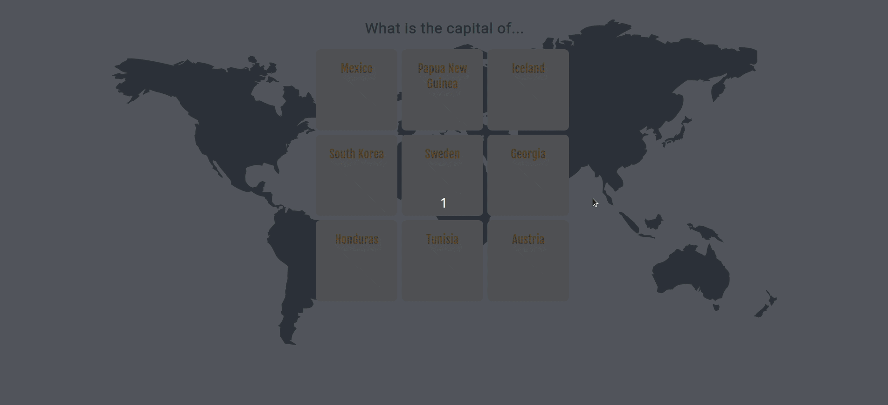

# Flashcards

Welcome to the Flashcards project! This interactive web application is designed to help users learn and memorize the capitals of various countries in a fun and engaging way. Using a simple flip animation, users can test their knowledge by guessing the capital city before revealing the answer on the back of each card.



## Introduction

The Flashcards project utilizes HTML and CSS to create an interactive learning tool. It is styled with a clean, minimalist design and uses web fonts for improved readability and aesthetics. The project is designed to be responsive, making it accessible on a wide range of devices.

## Features

- **Interactive Flashcards:** Test your knowledge of world capitals with a simple mouse hover.
- **Smooth Flip Animation:** Each card flips smoothly to reveal the answer on the back, enhancing the user experience.
- **Responsive Design:** Enjoy learning on any device, thanks to the flexible layout.
- **Minimalist Aesthetic:** Clean design on usability and aesthetics.

## Installation

To use the Flashcards project on your local machine, follow these steps:

1. Clone the repository to your local machine:

```
git clone https://github.com/SonikSeven/flashcards-frontend.git
```

2. Navigate to the project directory:

```
cd flashcards-frontend
```

3. Open the `index.html` file in your browser to start learning!

## Usage

Using the Flashcards app is straightforward:

- **View a card:** Simply load the app in your browser, and you will be presented with a set of flashcards.
- **Test your knowledge:** Hover over a card to flip it and reveal the capital city on the back.
- **Continue learning:** Move to the next card and repeat the process to test your knowledge on different countries.

## License

This project is licensed under the [MIT License](LICENSE.txt).
